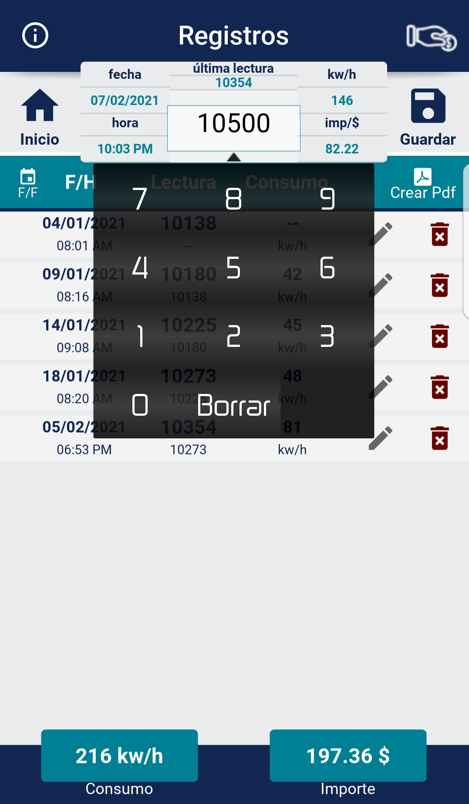
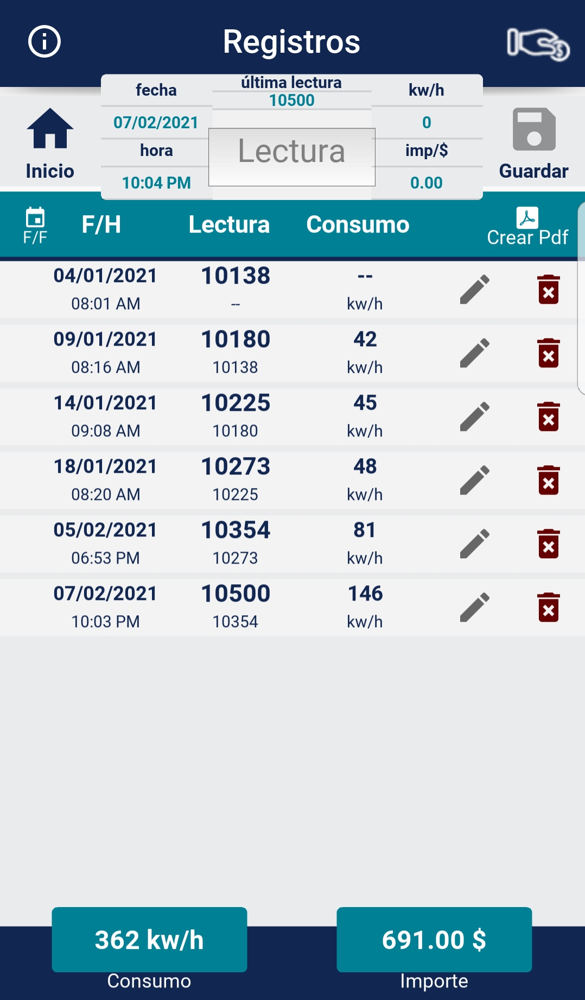
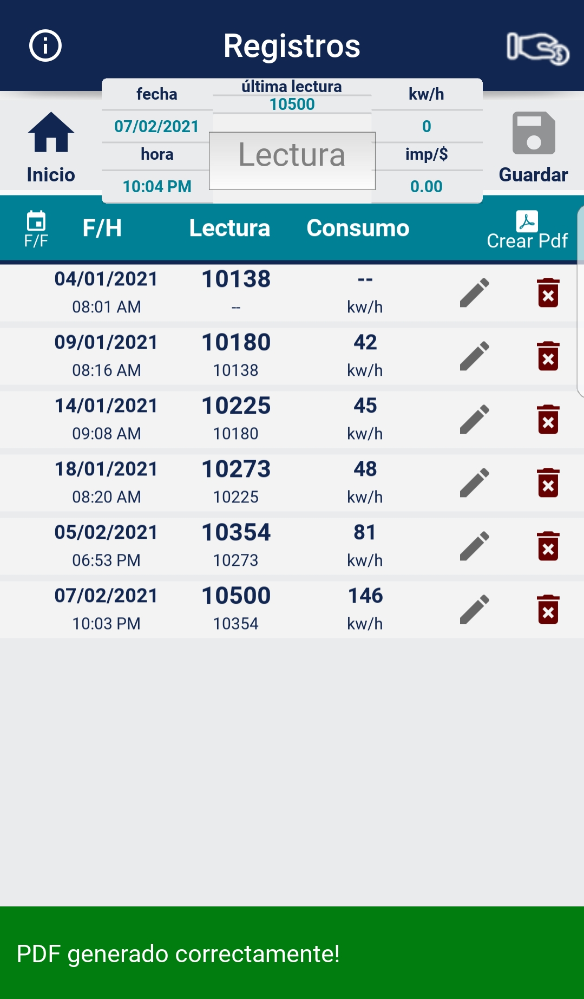
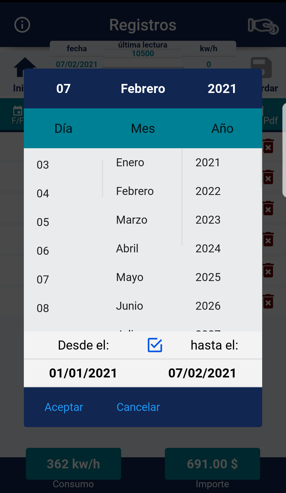
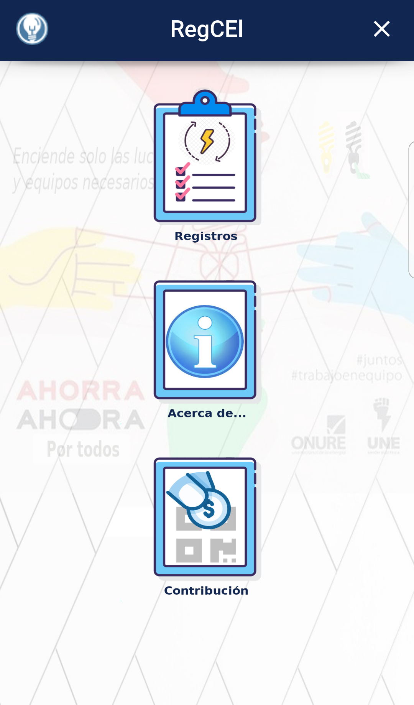

# RegCEl M_v1.0
==========================
Es una app desarrollada en python3 con el framework Kivy/KivyMD.
La misma permite llevar un registro con las lecturas del contador eléctrico en su hogar, calculando automáticamente 
los Kw/h consumidos y el importe a pagar mediante la tarifa residencial. Ha sido diseñada para ser fácil, intuitiva y generar una
experiencia confortable al usuario.

Funcionamiento:

Solo debe introducir la lectura de su contador, luego presionar el botón "Guardar", a partir del segundo
registro, RegCEl reconocerá automáticamente la ultima lectura introducida.

Siempre que abra la herramienta, se le mostrarán todos los registros guardados, pero puede filtrar por fecha los que 
desee ver desde el botón "F/F" con el icono de calendario.

Puede editar, eliminar o exportar a PDF los registros seleccionados... 
#Capturas:

